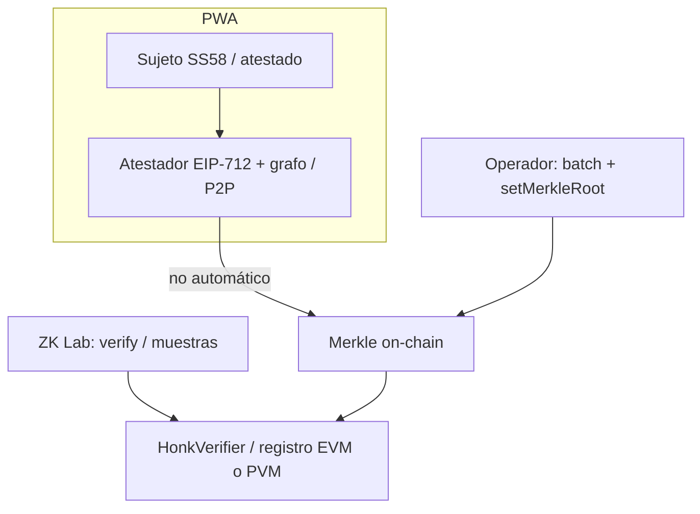

# Yohualli Protocol

*This file is in **English** and **Latin American Spanish (neutral)** — same content in both languages below.*

**License:** [LICENSE](LICENSE) (MIT). More protocol, circuit, and UX docs: [`docs/`](docs/). — **Licencia:** [LICENSE](LICENSE) (MIT). Más documentación: [`docs/`](docs/).

---

## English

**Yohualli** is meant to offer **“digital personhood” proofs** to communities that, by their nature, need to **keep participation anonymous** in **social, economic, or governance** settings: **peer-to-peer, verifiable trust** without putting graph topology, edges, or personal data on-chain.

The **normative draft** ([`docs/Yohualli Protocol draft 1.1.md`](docs/Yohualli%20Protocol%20draft%201.1.md)) describes a **three-layer** model: **sovereign PWA** (keys, local trust, ZK, encrypted storage), **P2P network** (attestations, relayers, gossip), and **on-chain settlement** (commitments, proof verification, Merkle roots, nullifiers). **The chain does not store the graph**; it only arbiters mathematical validity of proofs.

> **Phase 0 (this repository):** **technical feasibility** toward an **MVP**. We validated **provers / generated artifacts** on real devices (including **PWA on iOS and Android** for circuit proofs), **P2P** in the attestation / gossip path, and fit with **EVM verification** and **PVM** experiments.  
> **Next goal:** ship an **MVP** with a **whitepaper** or a **feasibility study** grounded in iterative learnings. Draft 1.1 has formulas and assumptions to **review and freeze**; phase 0 shows what is technically reachable and what remains **lab** vs **production**.

### Lab (ZK Lab) vs production

Phase 0 shows you can **generate proofs inside the PWA** on real devices. That does **not** mean every user must *bring your own infrastructure* just to *prove* **BYOI** (dev box, CI, node, helper) covers **reproducible dev pipeline** (nargo / bb), **redundancy** or **fallback** (low-end devices, batch jobs, server benchmarks), and **automation** (CI) when the “every phone, minutes SLA for a heavy circuit” does not hold yet. See [YOHUALLI_POC_PWA_PROVER_DILEMMA.md](docs/YOHUALLI_POC_PWA_PROVER_DILEMMA.md) and [CIRCUITS_LAB.md](docs/CIRCUITS_LAB.md).  
**Summary:** *ZK Lab* is a **manual** dev console; in production you can pair **PWA** as a first, sovereign path where **client proving is acceptable**, with repeatable **server-side** or integrator pipelines. Crypto roles: [YOHUALLI_EVM_CONTRACTS_ARCHITECTURE.md](docs/YOHUALLI_EVM_CONTRACTS_ARCHITECTURE.md).

#### Role flows (PoC sketch; full UX: linked doc)

> Full diagram: [YOHUALLI_FLUJOS_UX_ACTORES.md](docs/YOHUALLI_FLUJOS_UX_ACTORES.md) · short product: [YOHUALLI_FLUJO_PRODUCTO_CORTA.md](docs/YOHUALLI_FLUJO_PRODUCTO_CORTA.md)

- **Attest ≠** publishing `merkleRoot` for an *epoch*; the operator batches **off-chain** and anchors **on-chain** (Foundry scripts, see [`evm/yohualli_honk_verifier`](evm/yohualli_honk_verifier) and that package README).
- [YOHUALLI_ACERCAMIENTO_WHITEPAPER.md](docs/YOHUALLI_ACERCAMIENTO_WHITEPAPER.md) — phased path toward a whitepaper and locked circuits.

### From draft 1.1 to code (technical notes)

- **Layering and crypto hygiene** — **Substrate (SS58)** IDs fit **stable labels** in **gossip / relayers** and **off-chain** graph; what the **Honk** contract must see is aligned to **ECDSA secp256k1** (EIP-712 v0). See [YOHUALLI_EVM_CONTRACTS_ARCHITECTURE.md](docs/YOHUALLI_EVM_CONTRACTS_ARCHITECTURE.md).  
- **Privacy and Noir** — Commitments, Merkle, `nullifier`, and gadgets: `yohualli_*` in `circuits/`, v0/v1: [YOHUALLI_MERKLE_PROOF_V0.md](docs/YOHUALLI_MERKLE_PROOF_V0.md), [CIRCUITS_LAB.md](docs/CIRCUITS_LAB.md), [YOHUALLI_CIRCUIT_MERKLE_INCLUSION_V2.md](docs/YOHUALLI_CIRCUIT_MERKLE_INCLUSION_V2.md).  
- **EVM + Foundry (REVM in tests)** — `forge` / **REVM** for bytecode, forks, and Merkle registry scripts; separate from the **PVM** deploy target.  
- **PVM (PolkaVM) + resolc + `solc` front** — *Hub* contracts need **PolkaVM**; use [evm/polkadot_pvm](evm/polkadot_pvm) vs **Foundry** for “book” EVM. See [evm/polkadot_pvm/README.md](evm/polkadot_pvm/README.md).  
- **Barretenberg / `bb.js` I/O** — *Length is too large* / **msgpack scratch**: [scripts/patch-aztec-bb-msgpack-scratch.mjs](scripts/patch-aztec-bb-msgpack-scratch.mjs) and *Vite* / `CIRCUITS_LAB` / *vite config*.

**Relay / graph (lab):** [yohualli-gossip-relay-lab.md](docs/yohualli-gossip-relay-lab.md) · tiers: [yohualli-tier-sybilrank-matematica.md](docs/yohualli-tier-sybilrank-matematica.md).

### Run (short)

- **PWA** — *Yarn 4*. `corepack enable` → `NPM_CONFIG_USER_AGENT=npm/10.0.0 yarn install` → `yarn dev` / `yarn build`  
- **Env (no keys in shell history):** [`.env.example`](.env.example) → `.env.local`, [`.env.forge.example`](.env.forge.example) → `.env.forge.local` — [docs/ENV_SAFETY.md](docs/ENV_SAFETY.md), `yarn yoh:toolbox`  
- **Testnet + `VITE_*`:** [YOHUALLI_TESTNET_OPERATIVO.md](docs/YOHUALLI_TESTNET_OPERATIVO.md)  
- **Aura (wallet) vs this repo:** [docs/aura/README.md](docs/aura/README.md) — upstream [aura-pwa](https://github.com/cryptohumano/aura-pwa)  
- **Circuits** — [CIRCUITS_LAB.md](docs/CIRCUITS_LAB.md)  
- **EVM** — `evm/yohualli_honk_verifier/`  
- **PVM** — `yarn pvm:compile` from [evm/polkadot_pvm](evm/polkadot_pvm)

### Doc index (protocol)

| Doc | What |
|-----|------|
| [protocol-docs-languages.md](docs/protocol-docs-languages.md) | Which files are English + Latin American Spanish |
| [Yohualli Protocol draft 1.1.md](docs/Yohualli%20Protocol%20draft%201.1.md) | Vision, hybrid architecture, crypto |
| [YOHUALLI_EVM_CONTRACTS_ARCHITECTURE.md](docs/YOHUALLI_EVM_CONTRACTS_ARCHITECTURE.md) | IDs, HD, gas *vs* proof, lab tables |
| [YOHUALLI_FLUJOS_UX_ACTORES.md](docs/YOHUALLI_FLUJOS_UX_ACTORES.md) | *Mermaid* by actor |
| [CIRCUITS_LAB.md](docs/CIRCUITS_LAB.md) / [en](docs/CIRCUITS_LAB.en.md) | Noir, Barretenberg, ZK Lab |
| [YOHUALLI_POC_PWA_PROVER_DILEMMA.md](docs/YOHUALLI_POC_PWA_PROVER_DILEMMA.md) / [en](docs/YOHUALLI_POC_PWA_PROVER_DILEMMA.en.md) | Where the prover lives |
| [YOHUALLI_ATTESTATION_SIGNING_V0.md](docs/YOHUALLI_ATTESTATION_SIGNING_V0.md) | EIP-712, `subjectCommitment` |
| [YOHUALLI_TESTNET_OPERATIVO.md](docs/YOHUALLI_TESTNET_OPERATIVO.md) | Testnet + `VITE_*` |
| [docs/ENV_SAFETY.md](docs/ENV_SAFETY.md) | `VITE_` *vs* forge, toolbox |
| [docs/aura/README.md](docs/aura/README.md) | Aura / Yohualli and upstream link |

**Next (publishable roadmap):** whitepaper or study with **reviewed and frozen** formulas vs phase 0, and **MVP** cut (circuit, verifier, registry, minimum community UX).

*Yohualli: verifiable trust without putting the social graph on-chain, and on-chain math only for critical settlement.*

---

## Español (América Latina)

**Yohualli** nace con la intención de ofrecer **pruebas de “personalidad digital”** a comunidades que, por su naturaleza, necesitan **preservar el anonimato** en dinámicas **sociales, económicas o de gobernanza**: **confianza p2p verificable** sin revelar topología de grafo, conexiones ni datos personales en la cadena.

En el **borrador normativo** ([`docs/Yohualli Protocol draft 1.1.md`](docs/Yohualli%20Protocol%20draft%201.1.md)) se plantea un modelo de **tres capas**: **PWA soberana** (claves, confianza local, ZK y almacenamiento cifrado), **red P2P** (atestaciones, *relayers*, *gossip*) y **asentamiento on-chain** (compromisos, verificación de pruebas, raíces Merkle, nullifiers). **La cadena no almacena el grafo**; arbitra la validez matemática de las pruebas.

> **Fase 0 (este repositorio):** validación de **viabilidad técnica** hacia un **MVP**. Se comprobó la generación de **provers y artefactos** en dispositivos reales (incl. **PWA en iOS y Android** con pruebas de circuito), el uso de **P2P** en el flujo de atestación o *gossip*, y el encaje con **verificación EVM** y experimentación en **PVM**.  
> **Meta inmediata:** cristalizar un **MVP** acompañado de un **whitepaper** o un **estudio de viabilidad** a partir de aprendizajes iterativos. El borrador 1.1 contiene fórmulas y suposiciones que deben **revisarse y congelarse**; esta fase fija qué es técnicamente alcanzable y qué queda en el **laboratorio** frente a **producción**.

### Trabajo en laboratorio (ZK Lab) y despliegue

En fase 0, **iOS y Android** muestran que se puede **generar pruebas en la PWA** en condiciones reales. Eso **no** significa que todo el mundo tenga que usar *bring your own infrastructure* solo para **poder** prover: *BYOI* (máquina de desarrollo, CI, nodo o *helper*) cumple otras funciones: **cierre** documental del *pipeline* (*nargo* / *bb*), **redundancia** o **respaldo** (gama baja, lotes, *benchmarks* en servidor) y **automatización** (CI) cuando aún no cierra un *SLA* del tipo “toda gama de móviles, en pocos minutos, para un circuito pesado”. Ver [YOHUALLI_POC_PWA_PROVER_DILEMMA.md](docs/YOHUALLI_POC_PWA_PROVER_DILEMMA.md) y [CIRCUITS_LAB.md](docs/CIRCUITS_LAB.md).  
**Resumen:** *ZK Lab* es un laboratorio con **pasos manuales**; en producción conviven la **PWA** como primera opción **soberana** mientras el *prove* en el cliente **sea aceptable**, y flujos repetibles en el servidor o con integradores. *Roles* cripto: [YOHUALLI_EVM_CONTRACTS_ARCHITECTURE.md](docs/YOHUALLI_EVM_CONTRACTS_ARCHITECTURE.md).

#### Flujos de roles (vista de PoC; el diagrama completo está en el documento de UX)

> Detalle: [YOHUALLI_FLUJOS_UX_ACTORES.md](docs/YOHUALLI_FLUJOS_UX_ACTORES.md) · resumen de producto: [YOHUALLI_FLUJO_PRODUCTO_CORTA.md](docs/YOHUALLI_FLUJO_PRODUCTO_CORTA.md)

(El *mermaid* es el mismo arriba en *English*.)

- **Atestar no es** publicar `merkleRoot` en un *epoch*; un operador consolida *off-chain* y ancla *on-chain* (*scripts* Foundry; [`evm/yohualli_honk_verifier`](evm/yohualli_honk_verifier) y *README* del paquete).
- [YOHUALLI_ACERCAMIENTO_WHITEPAPER.md](docs/YOHUALLI_ACERCAMIENTO_WHITEPAPER.md) ordena fases hacia *whitepaper* y circuitos congelados.

### Desde el borrador 1.1 al código (notas técnicas)

- **Higiene criptográfica y capas** — **SS58** para etiquetas en *gossip* y grafo; el contrato **Honk** ve **ECDSA secp256k1** (EIP-712 v0). [YOHUALLI_EVM_CONTRACTS_ARCHITECTURE.md](docs/YOHUALLI_EVM_CONTRACTS_ARCHITECTURE.md).  
- **Privacidad y Noir** — *Commitments*, Merkle, *nullifier*: [YOHUALLI_MERKLE_PROOF_V0.md](docs/YOHUALLI_MERKLE_PROOF_V0.md), [CIRCUITS_LAB.md](docs/CIRCUITS_LAB.md), [YOHUALLI_CIRCUIT_MERKLE_INCLUSION_V2.md](docs/YOHUALLI_CIRCUIT_MERKLE_INCLUSION_V2.md).  
- **EVM + Foundry (REVM en *test*)** — *tooling* EVM, *forks* y *registry* Merkle.  
- **PVM y *resolc*** — *Hub* con **PolkaVM**: [evm/polkadot_pvm](evm/polkadot_pvm) y [evm/polkadot_pvm/README.md](evm/polkadot_pvm/README.md).  
- **Límites de Barretenberg** — *msgpack* y [scripts/patch-aztec-bb-msgpack-scratch.mjs](scripts/patch-aztec-bb-msgpack-scratch.mjs) (*ver* *CIRCUITS_LAB* / *Vite*).

**Relay y grafo (laboratorio):** [yohualli-gossip-relay-lab.md](docs/yohualli-gossip-relay-lab.md) · *tiers:* [yohualli-tier-sybilrank-matematica.md](docs/yohualli-tier-sybilrank-matematica.md).

### Código y puesta a marcha (resumen)

- **PWA (raíz):** *Yarn 4* — `corepack enable` → `NPM_CONFIG_USER_AGENT=npm/10.0.0 yarn install` → `yarn dev` o `yarn build`  
- **Entorno (sin dejar *keys* en el *CLI*):** [`.env.example`](.env.example) → **`.env.local`**, [`.env.forge.example`](.env.forge.example) → **`.env.forge.local`**, [docs/ENV_SAFETY.md](docs/ENV_SAFETY.md) y `yarn yoh:toolbox check` o `run`. *Testnet* y `VITE_*`: [YOHUALLI_TESTNET_OPERATIVO.md](docs/YOHUALLI_TESTNET_OPERATIVO.md)  
- **Aura (wallet) y este *repo*:** [docs/aura/README.md](docs/aura/README.md) — repositorio [github.com/cryptohumano/aura-pwa](https://github.com/cryptohumano/aura-pwa)  
- **Circuitos:** *Noir* y *scripts* en [CIRCUITS_LAB.md](docs/CIRCUITS_LAB.md)  
- **EVM:** `evm/yohualli_honk_verifier/`  
- **PVM:** `yarn pvm:compile` desde [evm/polkadot_pvm](evm/polkadot_pvm)

### Documentación clave (índice)

| Documento | Contenido |
|-----------|-----------|
| [protocol-docs-languages.md](docs/protocol-docs-languages.md) | Qué archivos van en inglés + español (AL) |
| [Yohualli Protocol draft 1.1.md](docs/Yohualli%20Protocol%20draft%201.1.md) | Visión, arquitectura híbrida, cripto de alto nivel |
| [YOHUALLI_EVM_CONTRACTS_ARCHITECTURE.md](docs/YOHUALLI_EVM_CONTRACTS_ARCHITECTURE.md) | Identificadores, HD, *gas* y prueba, tablas *lab* |
| [YOHUALLI_FLUJOS_UX_ACTORES.md](docs/YOHUALLI_FLUJOS_UX_ACTORES.md) | *Mermaid* por actor |
| [CIRCUITS_LAB.md](docs/CIRCUITS_LAB.md) / [en](docs/CIRCUITS_LAB.en.md) | Noir, Barretenberg, ZK Lab |
| [YOHUALLI_POC_PWA_PROVER_DILEMMA.md](docs/YOHUALLI_POC_PWA_PROVER_DILEMMA.md) / [en](docs/YOHUALLI_POC_PWA_PROVER_DILEMMA.en.md) | Dónde vive el *prover* en un despliegue real |
| [YOHUALLI_ATTESTATION_SIGNING_V0.md](docs/YOHUALLI_ATTESTATION_SIGNING_V0.md) | EIP-712, `subjectCommitment` |
| [YOHUALLI_TESTNET_OPERATIVO.md](docs/YOHUALLI_TESTNET_OPERATIVO.md) | *Testnet* y `VITE_*` |
| [docs/ENV_SAFETY.md](docs/ENV_SAFETY.md) | Reglas `VITE_` y *forge*; *toolbox* |
| [docs/aura/README.md](docs/aura/README.md) | Relación Aura / Yohualli y enlace *upstream* |

**Siguiente paso (hoja de ruta publicable):** consolidar *whitepaper* o estudio con **fórmulas y suposiciones revisadas** frente a la fase 0 y fijar el corte de **MVP** (circuito, verificador, *registry*, *UX* mínima de comunidad).

*Yohualli: confianza verificable sin delegar el grafo a la cadena, y prueba matemática donde hace falta fijar el estado crítico.*
