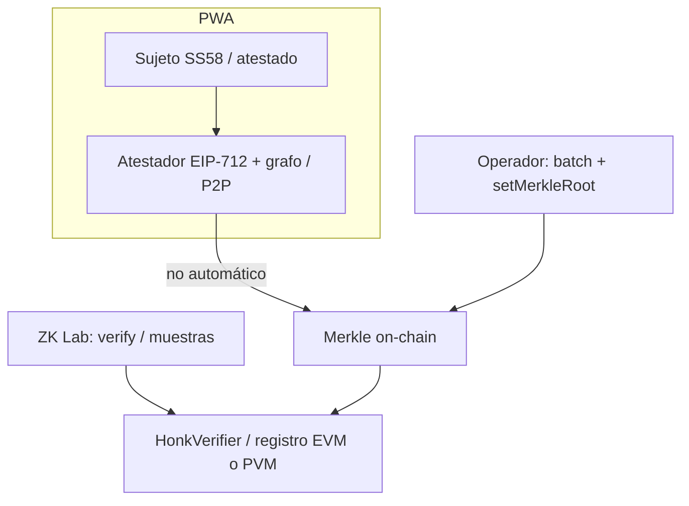

# Yohualli Protocol

**Yohualli** nace con la intención de ofrecer **pruebas de “personalidad digital”** a comunidades que, por su naturaleza, necesitan **preservar el anonimato** en su participación activa en dinámicas **sociales, económicas o de gobernanza**: la **confianza p2p verificable** sin revelar topología de grafo, conexiones ni datos personales en la cadena.

En el **borrador normativo** ([`docs/Yohualli Protocol draft 1.1.md`](docs/Yohualli%20Protocol%20draft%201.1.md)) se plantea un modelo de tres capas: **PWA soberana** (claves, confianza local, ZK y almacenamiento cifrado), **red P2P** (atestaciones, *relayers*, *gossip*) y **asentamiento on-chain** (compromisos, verificación de pruebas, raíces Merkle, nullifiers). **La cadena no almacena el grafo**; arbitra la validez matemática de las pruebas.

> **Fase 0 (este repositorio):** validación de **viabilidad técnica** hacia un **MVP**. Se ha comprobado la generación de **provers/artefactos** en dispositivos reales (incl. **PWA en iOS y Android** con pruebas de circuito), el uso de **P2P** en el flujo de atestación/gossip, y el encaje con **verificación EVM** y experimentación **PVM**.  
> **Meta inmediata:** cristalizar un **MVP** acompañado de un **whitepaper** o un **estudio de viabilidad** basado en los aprendizajes iterativos. El borrador 1.1 contiene fórmulas y suposiciones que deben **revisarse y congelarse** en una versión normativa; esta fase ha servido justamente a **fijar** qué es técnicamente alcanzable y qué queda en el laboratorio *vs* producción.

**Licencia:** [LICENSE](LICENSE) (MIT, alineada con el remoto del proyecto). Documentación adicional de protocolo, circuitos y UX está en [`docs/`](docs/).

---

## Trabajo en laboratorio (ZK Lab) *vs* despliegue en producción

En fase 0, **iOS y Android** ya demuestran que se puede **generar pruebas en la PWA** en condiciones reales. Eso **no** implica que todo usuario deba *bring your own infrastructure* *solo* para *poder* prover: *BYOI* (máquina de dev, CI, nodo o servicio *helper*) cumple otras funciones: **cierre** documental del *pipeline* (*nargo* / *bb*), **redundancia** o **respaldo** (móviles de gama baja, lotes, *benchmarks* en servidores) y **automatización** (CI) cuando el *SLA* “toda gama, en pocos minutos, para un circuito pesado” aún no cierra. Ver [YOHUALLI_POC_PWA_PROVER_DILEMMA.md](docs/YOHUALLI_POC_PWA_PROVER_DILEMMA.md) y [CIRCUITS_LAB.md](docs/CIRCUITS_LAB.md).  
**En resumen:** *ZK Lab* es el laboratorio con **pasos manuales**; en producción conviven **PWA** como primera opción *soberana* mientras el *prove* en cliente *sea aceptable*, y cadenas repetibles en entornos *server-side* o integradores. Detalle de *roles* cripto: [YOHUALLI_EVM_CONTRACTS_ARCHITECTURE.md](docs/YOHUALLI_EVM_CONTRACTS_ARCHITECTURE.md).

### Flujos de roles (vista de PoC; diagrama completo en el doc de UX)

> Diagrama detallado: [YOHUALLI_FLUJOS_UX_ACTORES.md](docs/YOHUALLI_FLUJOS_UX_ACTORES.md) · Producto resumido: [YOHUALLI_FLUJO_PRODUCTO_CORTA.md](docs/YOHUALLI_FLUJO_PRODUCTO_CORTA.md)



- **Atestar ≠** publicar `merkleRoot` en un *epoch*; el operador consolida *off-chain* y ancla *on-chain* (scripts Foundry, ver [`evm/yohualli_honk_verifier`](evm/yohualli_honk_verifier) y *README* alojado ahí).
- [YOHUALLI_ACERCAMIENTO_WHITEPAPER.md](docs/YOHUALLI_ACERCAMIENTO_WHITEPAPER.md) ordena fases hacia *whitepaper* y circuitos congelados.

---

## Hallazgos técnicos desde la concepción (borrador 1.1 → código)

- **Higiene criptográfica y capas**  
  Identificadores **Substrate (SS58)** encajan con **etiquetas estables** en *gossip* / *relayers* y construcción de **grafo** *off-chain*; lo que el contrato *Honk* debe ver entra alineado con **ECDSA `secp256k1`** (EIP-712, *payload* v0). Tabla y convención en [YOHUALLI_EVM_CONTRACTS_ARCHITECTURE.md](docs/YOHUALLI_EVM_CONTRACTS_ARCHITECTURE.md). El borrador 1.1 fija *curva* y *derivación*; la fase 0 aterriza **paths BIP44**, “quién paga *gas*” *vs* “qué clave atestó”, y **no** mezclar filas en tablas de identidad.
- **Privacidad y Noir**  
  Compromisos, Merkle, `nullifier` y gadgets acordes al diseño (incl. `yohualli_*` bajo `circuits/`, lab de integración y Merkle *v0/v1* documentados en [YOHUALLI_MERKLE_PROOF_V0.md](docs/YOHUALLI_MERKLE_PROOF_V0.md), [CIRCUITS_LAB.md](docs/CIRCUITS_LAB.md), [YOHUALLI_CIRCUIT_MERKLE_INCLUSION_V2.md](docs/YOHUALLI_CIRCUIT_MERKLE_INCLUSION_V2.md).
- **EVM + Foundry (REVM en *test*)**  
  *Tests*, verificador `Honk`, *fork* y scripts del *registry* Merkle: **Foundry** aporta el *tooling* fiable para bytecode EVM, simulación y *forks* (en la práctica vía **REVM** bajo *forge*). Eso es distinto al **destino** de *deploy* en la *Hub* Polkadot (más abajo).
- **PVM (Polkadot Virtual Machine) y *solc* vía *resolc***  
  Un *pipeline* pensado “solo *Hardhat* + pila EVM/REVM” **no basta** para *smart contracts* en *Hub*: el runtime espera **PolkaVM** (bytecode `0x50564D…` *etc.*) y *tooling* **Parity** (`@parity/hardhat-polkadot`, *compile* hacia *resolc*). En el *lab* se convive con **Foundry** para el verificador EVM “de libro” y se usa [evm/polkadot_pvm](evm/polkadot_pvm) para *compile/deploy* hacia *PVM*. Ver [evm/polkadot_pvm/README.md](evm/polkadot_pvm/README.md) (límites, *chainId*, *solc* front) y [YOHUALLI_EVM_CONTRACTS_ARCHITECTURE.md](docs/YOHUALLI_EVM_CONTRACTS_ARCHITECTURE.md).
- **Límites de Barretenberg / *bb.js* (mensaje demasiado largo)**  
  Con versiones de `@aztec/bb.js` el **buffer I/O (msgpack)** hacia el WASM quedó corto: aparecían fallos del tipo *Length is too large* o presión de memoria en *proofs* medianos (p. ej. *keccak*, circuitos gordos). Se documenta y atenúa vía *postinstall* y variables (`BB_MSGPACK_*`) en [scripts/patch-aztec-bb-msgpack-scratch.mjs](scripts/patch-aztec-bb-msgpack-scratch.mjs) y *Vite* (ver *CIRCUITS_LAB* / comentarios en *vite*).

**Relay / grafo (lab):** [yohualli-gossip-relay-lab.md](docs/yohualli-gossip-relay-lab.md) · Tiers e ideas analíticas: [yohualli-tier-sybilrank-matematica.md](docs/yohualli-tier-sybilrank-matematica.md).

---

## Código y puesta a marcha (resumen)

- **PWA (raíz del repo):** *Yarn 4* (`packageManager` en *package.json*).

  ```bash
  corepack enable
  NPM_CONFIG_USER_AGENT=npm/10.0.0 yarn install
  # o: yarn run install:reliable
  yarn dev
  yarn build
  ```

- **Entorno (sin exponer *keys* *en* *CLI*):** plantillas [`.env.example`](.env.example) y [`.env.forge.example`](.env.forge.example) → *copiar* a `.env.local` / `.env.forge.local`; [docs/ENV_SAFETY.md](docs/ENV_SAFETY.md) y `yarn yoh:toolbox check` / `run`. *Testnet* y *VITE_*: [YOHUALLI_TESTNET_OPERATIVO.md](docs/YOHUALLI_TESTNET_OPERATIVO.md).
- **Aura (wallet) *vs* *este* *repo*:** *origen* *Substrate* / billetera: [docs/aura/README.md](docs/aura/README.md) (enlaza a [github.com/cryptohumano/aura-pwa](https://github.com/cryptohumano/aura-pwa)).
- **Circuitos:** *Noir* en `circuits/`, *scripts* `npm run` documentados en [CIRCUITS_LAB.md](docs/CIRCUITS_LAB.md).
- **EVM (Foundry):** `evm/yohualli_honk_verifier/`.
- **PVM (Hardhat + Polkadot):** `yarn pvm:compile` / *deploy* de prueba desde [evm/polkadot_pvm](evm/polkadot_pvm).

---

## Documentación clave (índice)

| Documento | Contenido |
|----------|------------|
| [Yohualli Protocol draft 1.1.md](docs/Yohualli%20Protocol%20draft%201.1.md) | Visión, arquitectura híbrida, cripto de alto nivel |
| [YOHUALLI_EVM_CONTRACTS_ARCHITECTURE.md](docs/YOHUALLI_EVM_CONTRACTS_ARCHITECTURE.md) | Identificadores, HD, *gas* *vs* prueba, tablas *lab* |
| [YOHUALLI_FLUJOS_UX_ACTORES.md](docs/YOHUALLI_FLUJOS_UX_ACTORES.md) | *Mermaid* por actor (Atestaciones, ZK Lab, operador) |
| [YOHUALLI_POC_PWA_PROVER_DILEMMA.md](docs/YOHUALLI_POC_PWA_PROVER_DILEMMA.md) | Dónde vive el prover en un despliegue realista |
| [YOHUALLI_ATTESTATION_SIGNING_V0.md](docs/YOHUALLI_ATTESTATION_SIGNING_V0.md) | EIP-712, `subjectCommitment` |
| [YOHUALLI_TESTNET_OPERATIVO.md](docs/YOHUALLI_TESTNET_OPERATIVO.md) | *Testnet* y *variables* *VITE* |
| [docs/ENV_SAFETY.md](docs/ENV_SAFETY.md) | Reglas *VITE_* *vs* *forge*; *toolbox* *CLI* |
| [docs/aura/README.md](docs/aura/README.md) | Relación *Aura* / *Yohualli* y enlace *upstream* *wallet* |

**Siguiente paso (*roadmap* publicable):** consolidar *whitepaper* o estudio con **fórmulas y suposiciones revisadas** frente a lo comprobado en fase 0, y fijar el corte de **MVP** (circuito, verificador, *registry*, UX mínima de comunidad).

---

*Yohualli: confianza verificable sin delegar el grafo a la cadena, y prueba matemática allí donde importa asentar el estado crítico.*
