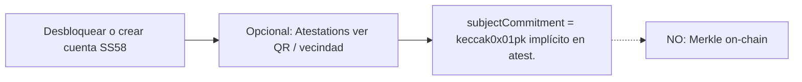
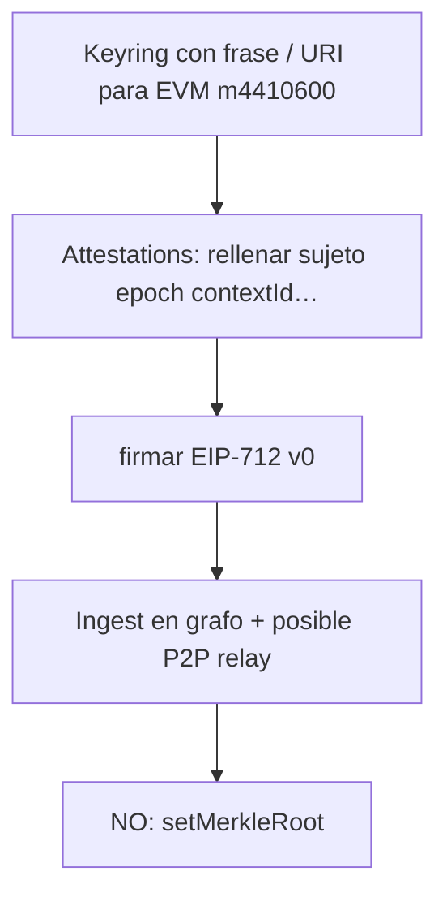
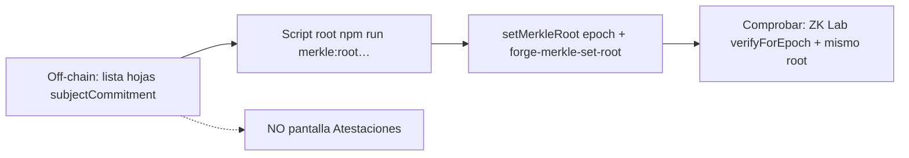
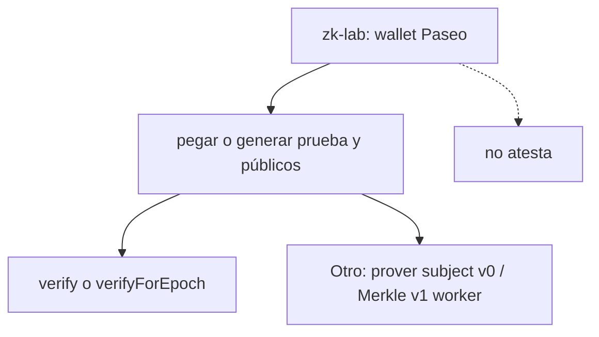

# Flujos UI/UX por actor (entorno compartido: Atestaciones + ZK Lab)

En la PWA, **`/attestations`** y **`/zk-lab`** conviven con **cuentas, identidad y billetera EVM**; sin marcar papeles, mezclan lenguaje de *desarrollador* y de *usuario final*. Este documento fija **quién hace qué, en qué pantalla** y qué se puede confundir. Complementa [YOHUALLI_FLUJO_PRODUCTO_CORTA.md](YOHUALLI_FLUJO_PRODUCTO_CORTA.md).

---

## 1. Actores y ruta “principal”

| Actor | Objetivo en un uso típico | Ruta de entrada (hoy) | Cosa que **no** debería esperar aquí |
|------|---------------------------|------------------------|--------------------------------------|
| **A) Sujeto (Substrate)** | Tener cuenta, compartir identidad en QR, *ser* el `subject` de atestación | `Home` → Cuentas (`/accounts`), a veces `Attestations` (panel QR / vecindad) | Publicar *merkle root* on-chain, verificar *Honk*; eso no es un click suyo |
| **B) Atestador (Substrate + EVM atest.)** | Firmar EIP-712 hacia un sujeto, ver grafo, gossip | `Attestations` (`/attestations`) | Que su firma *suba sola* el lote a `MerkleHonkRegistry`; hoy **no** |
| **C) Operador de confianza (batch / on-chain)** | Fijar `setMerkleRoot(epoch, root)` con un lote de `subjectCommitment` acordado | **Fuera de la PWA** (Foundry, scripts) o futuro *panel* operador. En la PWA: solo **revisar** coherencia en `ZK Lab` (lectura de `merkleRoot`) | Atestar desde el mismo flujo: son roles distintos |
| **D) Investigador / dev ZK** | Probar *prover* WASM, pegar *proof*/públicos, *verify* y `verifyForEpoch` | `ZK Lab` (`/zk-lab`) | Necesidad de entender relé, gossip o QR de *ceremonia*; es una **consola** técnica |
| **E) Visitante / auditora** | Replicar o auditar (lectura) | Cualquiera, idealmente *docs* + *zk-lab* con *sample* | Acciones que requieren *private key* |

*Trusted seed* (lista de lab) es hoy un **criterio de puntuación + demos**, no un *botón* “soy *trusted*” en cadena. Ver [trustedSeedsLab](../src/social-graph/trustedSeedsLab.ts) y *Sybil* en *docs* de tier.

---

## 2. Flujos (paso a paso) — hoy

### 2.1. A — Sujeto: “entrar al grafo como identidad v0”

- **Dónde:** Cuentas (`/accounts`, `/accounts/import`…), `Attestations` (visualización, QR según *panel*).
- **Dato clave:** su **SS58** define el *subject* en el *typed data*; el **no** *publica* la raíz Merkle.
- **Dolor frecuente:** Pertenencia al **Merkle** = decisión *off-chain* + *setMerkleRoot*; la UI no explica aún esa separación.

**Copy sugerido (micro):** *“La red social local crece con atestaciones. La raíz pública on-chain (si existe) la fija un operador con otra herramienta, no al atestar solos.”*

---

### 2.2. B — Atestador: “firmar hacia alguien y reenviar *gossip*”

- **Dónde:** `Attestations` (formulario, *sign*, tabla, grafo, *gossip*).
- **Dato clave:** `subjectCommitment` y firma; **arista** atestador → sujeto.
- **Dolor frecuente:** Confundir *“tengo una atestación”* con *“soy hoja bajo el Merkle on-chain de este epoch”*; **solo** pasa lo segundo si un **operador** incluyó vuestro `subjectCommitment` en un *batch* y publicó la *root*.

**Copy sugerido:** *“La atestación añade o refuerza el grafo. La inscripción pública *en lote* (Merkle) no es la misma acción.”*

---

### 2.3. C — Operador: *snapshot* y ancla (entorno hoy: CLI)

- **Dónde “ver” resultado:** *Opcional* `ZK Lab` — *merkle* leída del *registry* + cotejo con pública. **No** hay aún *wizard* “publicar lote” en PWA.
- **Dolor:** *Operador* y *inversor* a veces reutilizan *zk-lab* sin darse cuenta; conviene *header* o *doc* fijo.

**Copy / producto (recomendación de pantalla):** a futuro, una *ruta* `/governance-merkle` o sección restringida; *hoy* enlazar a `docs` + *scripts* en README *evm*.

---

### 2.4. D — Investigador ZK: *prover* + *verify* + *Paseo EVM*

- **Dónde:** `ZK Lab` (varias *cards*: *square*, *Merkle v1*, *subject* v0, *importar* muestras, direcciones *VITE*).
- **Dolor:** Tres *circuitos* y dos *caminos* (*Honk* solo vs *registry*); fácil poner *verificador* de *v0* a prueba *v1*; la UI ya *hintea*; mantener *epoch* = *0* y *mismo* *root* que *setMerkleRoot*.

**Copy sugerido (header de *zk-lab*):** *“Laboratorio *dev*: no afecta a quién *atestáis*; usa las mismas variables *VITE* que *testnet*.”*

---

## 3. Mapa *mental*: una pantalla, un propósito (objetivo de diseño)

| Pantalla | Propósito único (objetivo) | Evitar mostrar *como* primario… |
|----------|----------------------------|---------------------------------|
| **Attestations** | Relación social y firma *EIP-712* | Tuning de *verifier* *Honk* *bytecode* |
| **ZK Lab** | Cripto/EVM: *verify*, *prove* de prueba, *muestras* | Flujo *“invitar* a *friend* a *at*" sin contexto *wallet* *Substrate* |
| **Identity** | *Perfil* / *docs* (según tengáis) | *Batch* *Merkle* (salvo añadáis sección) |
| **Cuentas** | Gestionar *seeds* *SS58* | *Registry* *owner* (salvo *power* *user* explícita) |

---

## 4. Recomendaciones ligeras de *UX* (sin reescribir la app ahora)

1. **Banner* condicional* en** `Attestations` **(info):** 2–3 líneas *qué* es *grafo* vs *qué* *no* toca *chain*; enlace a `YOHUALLI_FLUJO_PRODUCTO_CORTA` o a esta doc.
2. **Banner* en** `ZkLab` **(warning / info *dev*):** *misma* *frase* que *arriba* en *copy* *D*.
3. **Nav** (si tenéis *sidebar*): agrupar *Atestación social* (Attestations) y *Herramienta ZK* (ZK Lab) bajo títulos distintos, no *solo* *lista* plana.
4. **Operador:** *documentar* *runbook* en 5 *bullets* (root → *epoch* → *verify*) en *link* *visible* (README *evm* o *“Operador”* *anchor*).

---

## 5. Relación con *trusted seed* (producto, no *smart contract*)

- **Atesto** a alguien **desde** una *cuenta* *trusted* (lista *lab*): afecta **cálculo** *Sybil* y **política** *off-chain* *si* luego *entra* a un *lote* *Merkle* **decidido** por *operación*.
- **Nada* de *eso* **auto** *invoca* `setMerkleRoot`.

---

*Última alineación con *router*:* [`/attestations`], [`/zk-lab`]* — ver [`src/router/index.tsx`](../src/router/index.tsx).
